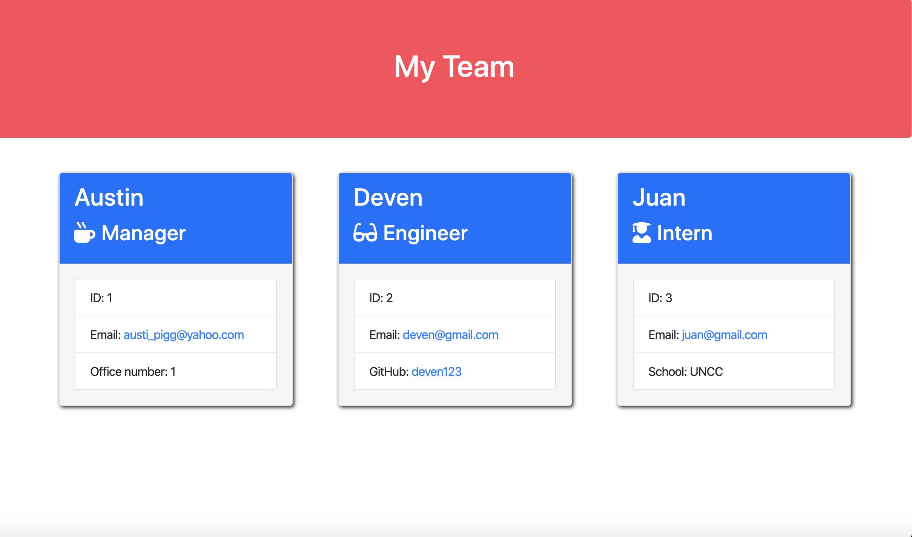
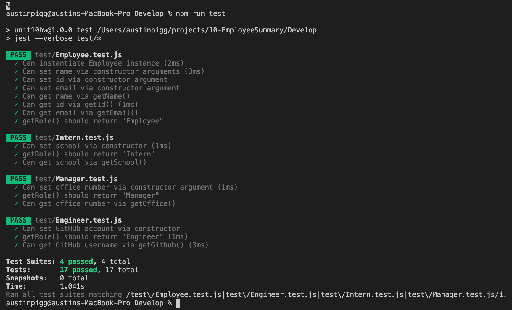

# 10-EmployeeSummary

## Description

* This application creates a team member roster as well as a little information about each person like their name, their position, email, etc.

* To run the file, type "node app" or "node app.js"

## Link to Repository

* https://github.com/alp13097/10-EmployeeSummary

## Screenshots

